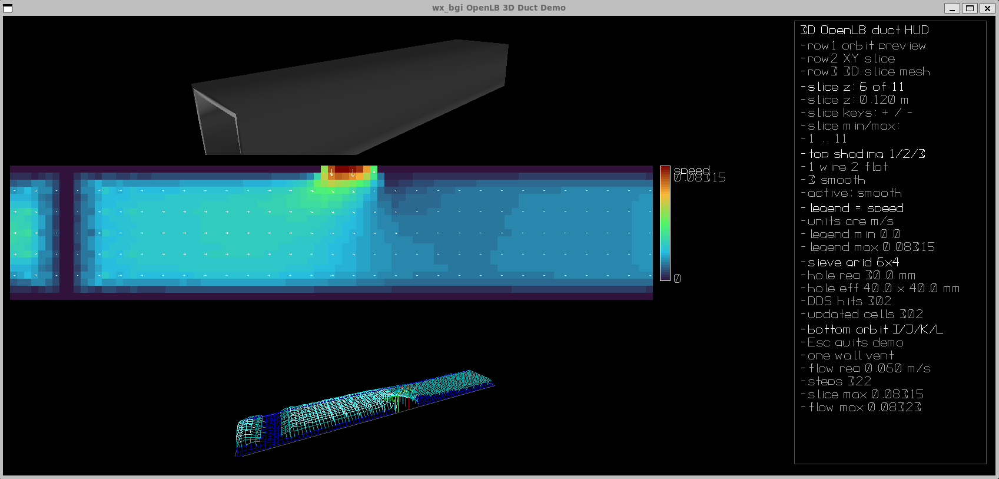
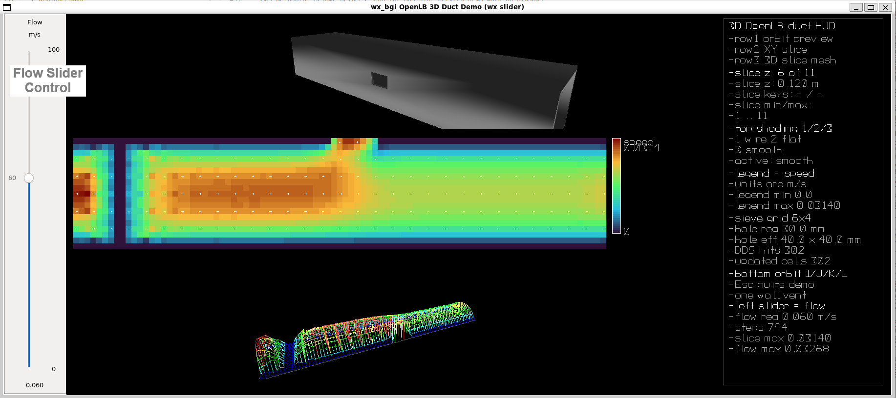

# OpenLB Support

`wx_bgi_graphics` does **not** turn OpenLB into a built-in GUI toolkit. Instead,
it provides a practical way to use `wx_bgi` as the **interactive viewer shell**
around an OpenLB simulation.

OpenLB remains the simulation owner:

1. OpenLB advances the solver.
2. Your code extracts scalar/vector snapshots from the current state.
3. `wx_bgi` renders those snapshots live in a wx-backed window.

---

## What is OpenLB?

[OpenLB](https://www.openlb.net/) is an open-source C++ framework for
Lattice Boltzmann Method (LBM) simulation. It is aimed at Computational Fluid Dynamics (CFD) and related
transport problems, involving multiple physics(physical) systems, with strong emphasis on:

- batch / HPC workflows
- MPI / OpenMP / GPU-capable simulation backends
- offline output such as VTK, images, CSV, and plots

OpenLB itself is primarily a **simulation framework**, not a live interactive
windowing system. That is where `wx_bgi_graphics` fits in.

---

## What support is provided here?

The shared library now includes an **optional OpenLB-oriented live-view path**
with these parts:

### 1. Generic field-visualization helpers

Declared in `src/wx_bgi_ext.h`:

- `wxbgi_field_draw_scalar_grid(...)`
- `wxbgi_field_draw_vector_grid(...)`
- `wxbgi_field_draw_scalar_legend(...)`

These are generic solver-view helpers, not OpenLB-only APIs. They are intended
for live rendering of:

- velocity magnitude
- pressure / density
- vector arrows
- legends and HUD overlays

### 2. Header-only live-loop wrappers, bridge entry points, and materialization helpers

Declared in `src/wx_bgi_openlb.h`:

- `wxbgi_openlb_begin_session(...)`
- `wxbgi_openlb_pump()`
- `wxbgi_openlb_present()`
- `wxbgi_openlb_classify_point_material(...)`
- `wxbgi_openlb_sample_materials_2d(...)`
- `wxbgi_openlb_materialize_super_geometry_2d(...)` *(C++ helper template)*
- `wxbgi_openlb_materialize_super_geometry_3d(...)` *(C++ helper template)*

These wrappers support an **OpenLB-style non-blocking main loop** where the
simulation remains in charge and `wx_bgi` only handles rendering and event
pumping.

The two material-query functions form the current DDS-to-OpenLB bridge MVP:

- `wxbgi_openlb_classify_point_material(...)` classifies one world-space sample
  point against the retained DDS scene and returns the resolved material id
- `wxbgi_openlb_sample_materials_2d(...)` samples a regular 2D grid of world
  points and writes one material id per sample

The bridge reads generic DDS metadata from `externalAttributes` rather than
hard-coding OpenLB-only fields into the core DDS type.

The C++ helper templates `wxbgi_openlb_materialize_super_geometry_2d(...)` and
`wxbgi_openlb_materialize_super_geometry_3d(...)` keep OpenLB-specific types out
of the stable C ABI while still letting OpenLB-side code stamp DDS-authored
materials directly onto OpenLB `SuperGeometry<T,2>` and `SuperGeometry<T,3>`
instances.

### 3. Interactive demos

The repository now includes:

- `examples/cpp/wxbgi_openlb_live_demo.cpp`
- `examples/cpp/wxbgi_openlb_material_preview_demo.cpp`
- `examples/cpp/wxbgi_openlb_coupled_smoke.cpp`
- `examples/cpp/openlb-demo/wxbgi_openlb_pipe_3d_demo.cpp`
- `examples/cpp/openlb-demo/run_openlb_pipe_3d_demo.sh`
- `examples/cpp/openlb-demo/run_openlb_pipe_3d_demo_macos.sh`

`wxbgi_openlb_live_demo.cpp` uses a mock live field, but it demonstrates the
intended integration pattern for a real OpenLB solver:

```cpp
while (wxbgi_openlb_pump()) {
    stepSolverChunk();

    cleardevice();
    wxbgi_field_draw_scalar_grid(...);
    wxbgi_field_draw_vector_grid(...);
    wxbgi_field_draw_scalar_legend(...);

    wxbgi_openlb_present();
}
```

`wxbgi_openlb_material_preview_demo.cpp` demonstrates the authoring side of the
workflow:

1. build retained DDS solids and set-operations
2. attach OpenLB-facing metadata such as `openlb.material`
3. render the exact retained 3D scene through a perspective camera
4. sample a 2D material grid and preview it with `wxbgi_field_draw_scalar_grid`

`wxbgi_openlb_coupled_smoke.cpp` demonstrates the fully coupled 2D Linux path:

1. author a retained DDS obstacle and tag it with `openlb.material=5`
2. materialize that DDS obstacle onto an OpenLB `SuperGeometry<T,2>`
3. run a compact OpenLB channel-flow solve
4. render live velocity magnitude and vector arrows with `wxbgi_field_*`

`examples/cpp/openlb-demo/wxbgi_openlb_pipe_3d_demo.cpp` demonstrates a fully
coupled 3D DDS/OpenLB duct case:

1. author a retained rectangular pipe scene with a perforated sieve inlet plate
2. materialize the DDS sieve geometry onto an OpenLB `SuperGeometry<T,3>`
3. run a compact 3D duct-flow solve with an outlet and one side vent
4. render a longitudinal velocity slice while a second panel shows a 360-degree
   orbit view of the DDS geometry
5. switch the geometry panel between `--wireframe`, `--flat`, and `--smooth`
   from the keyboard with `1`, `2`, and `3`
6. optionally emit ParaView-friendly VTK output with `--vtk` (default 100
   iterations) or `--vtk-iterations N`
7. optionally change the requested sieve hole diameter with `--sieve-hole-mm N`;
   the demo scales the sieve row/column count from that request and then snaps
   the effective hole size to a lattice-safe value
8. optionally change the characteristic flow velocity with
   `--flow-velocity-ms N` (default `0.06`)
9. keep the demo running until the user presses `Esc` or closes the window

`examples/cpp/openlb-demo/run_openlb_pipe_3d_demo.sh` bootstraps the same demo
on Debian, Ubuntu, and Debian/Ubuntu-based WSL2 environments. It can install
the needed packages, clone the latest public OpenLB release tree into `/tmp`,
configure a temporary OpenLB-enabled build, and then run either the interactive
demo or the demo's short `--test` mode.

`examples/cpp/openlb-demo/run_openlb_pipe_3d_demo_macos.sh` does the same job on
macOS, using Homebrew-provided `wxwidgets` and `glfw` instead of FetchContent
for the windowing dependencies.

`examples/cpp/openlb-demo/wxbgi_openlb_pipe_3d_wx_slider_demo.cpp` is a wxWidgets
variant of the same 3D pipe demo. It embeds the BGI renderer inside a custom
`wxFrame`, adds a narrow left control panel, and uses a vertical slider to
change the requested inflow velocity live while the solver is running. OpenLB
supports this pattern for the demo because the inlet boundary is recomputed each
simulation tick from the current requested physical velocity instead of being
hard-wired at startup.

### 4. Optional build and staging support

OpenLB support is **opt-in**:

```text
WXBGI_ENABLE_OPENLB=ON
OPENLB_ROOT=<path to local OpenLB release tree>
```

For the latest public OpenLB version, clone the public GitLab release tree and
point `OPENLB_ROOT` at that checkout:

```bash
git clone https://gitlab.com/openlb/release.git openlb-release
cmake -S . -B build_openlb \
  -DCMAKE_BUILD_TYPE=Debug \
  -DWXBGI_ENABLE_OPENLB=ON \
  -DOPENLB_ROOT=/path/to/openlb-release
```

When enabled, the build adds:

- OpenLB option validation (`OPENLB_ROOT\src\olb.h` must exist)
- `openlb_bridge_package` target
- optional OpenLB-coupled demo targets for local validation

That staging target collects the current shared library, headers, and demo into
`build/openlb_bridge` so they can be referenced from an OpenLB checkout or demo
workflow.

For the one-command Linux bootstrap path, run:

```bash
examples/cpp/openlb-demo/run_openlb_pipe_3d_demo.sh
examples/cpp/openlb-demo/run_openlb_pipe_3d_demo.sh --vtk
examples/cpp/openlb-demo/run_openlb_pipe_3d_demo.sh --vtk-iterations 3000
examples/cpp/openlb-demo/run_openlb_pipe_3d_demo.sh --sieve-hole-mm 17.3
examples/cpp/openlb-demo/run_openlb_pipe_3d_demo.sh --flow-velocity-ms 0.04
```

For a short build-and-smoke-check instead of the indefinite interactive run:

```bash
examples/cpp/openlb-demo/run_openlb_pipe_3d_demo.sh --test
```

On macOS, use:

```bash
examples/cpp/openlb-demo/run_openlb_pipe_3d_demo_macos.sh
examples/cpp/openlb-demo/run_openlb_pipe_3d_demo_macos.sh --vtk
examples/cpp/openlb-demo/run_openlb_pipe_3d_demo_macos.sh --vtk-iterations 3000
examples/cpp/openlb-demo/run_openlb_pipe_3d_demo_macos.sh --sieve-hole-mm 17.3
examples/cpp/openlb-demo/run_openlb_pipe_3d_demo_macos.sh --flow-velocity-ms 0.04
```

Or the short validation mode:

```bash
examples/cpp/openlb-demo/run_openlb_pipe_3d_demo_macos.sh --test
```

For the wx slider variant, build and run the dedicated target directly:

```bash
cmake --build build_openlb --target wxbgi_openlb_pipe_3d_wx_slider_demo -j
./build_openlb/wxbgi_openlb_pipe_3d_wx_slider_demo
./build_openlb/wxbgi_openlb_pipe_3d_wx_slider_demo --test
```

Or use the matching bootstrap scripts:

```bash
examples/cpp/openlb-demo/run_openlb_pipe_3d_wx_slider_demo.sh
examples/cpp/openlb-demo/run_openlb_pipe_3d_wx_slider_demo.sh --flow-velocity-ms 0.04 --vtk
examples/cpp/openlb-demo/run_openlb_pipe_3d_wx_slider_demo_macos.sh
examples/cpp/openlb-demo/run_openlb_pipe_3d_wx_slider_demo_macos.sh --test
```

---

## DDS metadata convention for OpenLB

Every DDS object now has a generic `externalAttributes` map that can store
OpenLB-facing labels. The bridge currently uses these keys:

| Key | Meaning |
|---|---|
| `openlb.role` | semantic role such as `fluid`, `solid`, or `boundary` |
| `openlb.material` | explicit integer material id encoded as a string |
| `openlb.boundary` | optional boundary name such as `wall` or `inlet` |
| `openlb.priority` | integer tie-breaker when multiple solids overlap |
| `openlb.enabled` | `0`/`1` style on-off switch for export |

Useful DDS metadata APIs:

- `wxbgi_dds_set_external_attr(id, key, value)`
- `wxbgi_dds_get_external_attr(id, key)`
- `wxbgi_dds_clear_external_attr(id, key)`
- `wxbgi_dds_external_attr_count(id)`
- `wxbgi_dds_get_external_attr_key_at(id, index)`
- `wxbgi_dds_get_external_attr_value_at(id, index)`

## Supported bridge geometry subset

The current material-classification bridge supports retained:

- box
- sphere
- cylinder
- cone
- torus
- transform chains
- set-union, set-intersection, and set-difference nodes

Unsupported DDS object types are currently treated as non-exportable solver
geometry rather than being approximated silently.

## What is not provided?

The current support intentionally does **not** do the following:

- bundle OpenLB into the main shared library as a hard dependency
- expose OpenLB template internals through the stable DLL ABI
- replace OpenLB's own solver setup, meshing, or physics code
- provide direct built-in 3D iso-surface extraction from OpenLB fields
- export every DDS primitive type to solver geometry yet

In other words: this repo currently provides the **viewer/runtime bridge**, not
a full OpenLB binding layer.

## Yielding CPU Control or Multi-Threading

### The Constraint
wxWidgets is single-threaded for UI.
If you create something like:
```C
//Sample-only Not intended as actual working code
while (simulationRunning) {
    lattice.collideAndStream();
    updateVisualization();
}
```
inside:
• 	the frame constructor
• 	a button handler
• 	a slider handler
• 	a timer handler
• 	or anywhere in the main thread
…then wxWidgets never gets CPU time to repaint the slider.

### How to fix it (without pausing animation)
You have three correct options:

✔ Option 1 — Run OpenLB in a worker thread (recommended)
Move your simulation loop into a **std::thread** :
```C
//Sample-only Not intended as actual working code
std::thread simThread([this] {
    while (running) {
        lattice.collideAndStream();
        // signal GUI to refresh
        wxQueueEvent(this, new wxCommandEvent(EVT_SIM_UPDATE));
    }
});
simThread.detach();
```
Then your GUI stays responsive.

✔ Option 2 — Use a wxTimer to “tick” OpenLB
This is the simplest approach.
```C
//Sample-only Not intended as actual working code
void MyFrame::OnTimer(wxTimerEvent&)
{
    lattice.collideAndStream();
    glCanvas->Refresh(false);
}
```
This ensures:
• 	GUI thread stays alive
• 	Slider moves normally
• 	OpenLB runs at ~60 FPS

✔ Option 3 — Yield to the GUI inside your simulation loop
If you absolutely must run OpenLB in the main thread:
```C
//Sample-only Not intended as actual working code
while (running) {
    lattice.collideAndStream();
    wxYield();   // allow slider to repaint
}
```
(!) This is a last resort.
It works, but can cause reentrancy issues. Upon return from the YIELD, make sure to redirect to the control where you left off in your simulation loop.

---

## Recommended integration model

Use `wx_bgi` as the interactive visualization frontend:

1. author retained solver geometry in DDS
2. tag solids and set-operation nodes with `openlb.*` metadata
3. materialize lattice cells from DDS using
   `wxbgi_openlb_materialize_super_geometry_2d(...)` or
   `wxbgi_openlb_materialize_super_geometry_3d(...)`
4. advance OpenLB in your own control loop
5. publish reduced scalar/vector data for display
6. draw using the `wxbgi_field_*` helpers
7. keep the GUI responsive with `wxbgi_openlb_pump()` / `wxbgi_openlb_present()`
8. when using wxWidgets controls it is important to use mult-threaded programming or
   have suitable wxYield() method calls, to yield program-execution thread-control
   to wxWidgets GUI Controls. See the Note ( ** Yielding CPU Control or Multi-Threading ** ) above,
   that describes this in detail. 

If you only need offline classification rather than direct `SuperGeometry`
materialization, the lower-level C bridge functions
`wxbgi_openlb_classify_point_material(...)` and
`wxbgi_openlb_sample_materials_2d(...)` remain available.

This matches the current wx rendering model well:

- rendering stays on the GUI side
- the simulation loop stays under user control
- no blocking `wxIMPLEMENT_APP`-managed application loop is required

## Linux status

The latest public OpenLB GitLab release tree now builds successfully with the
OpenLB-facing helper layer and the real coupled smoke demo on Linux in this
repository.

Focused validation currently covers:

- `test_dds_external_attrs`
- `test_openlb_bridge_materialize_2d`
- `wxbgi_openlb_material_preview_demo`
- `wxbgi_openlb_coupled_smoke`
- `wxbgi_openlb_pipe_3d_demo`

## Windows / MSVC status

Local validation now includes a real OpenLB checkout at:

`C:\Users\hamma\AppData\Local\Temp\openlb-release`

An older checkout was also tested at:

`C:\Users\hamma\AppData\Local\Temp\openlb-release-1.6.0`

That is sufficient for `OPENLB_ROOT`, and the repository now wires a local
OpenLB-coupled smoke target when `WXBGI_ENABLE_OPENLB=ON`. However, the current
public OpenLB release still does **not** compile cleanly under native
Windows/MSVC in this environment. The observed failures are in OpenLB headers
and templates, not in the DDS bridge or viewer code in this repository.

Observed results so far:

- OpenLB `1.9.0` fails early on native MSVC because the current release assumes
  compiler builtins and feature detection that do not map cleanly to this toolchain
- OpenLB `1.6.0` gets much further, and this repository now includes both
  `external/tinyxml` and `external/tinyxml2` in the optional OpenLB include
  path so older releases are wired correctly
- even with that fix, OpenLB `1.6.0` still fails under native MSVC because
  OpenLB itself directly includes Unix-only headers such as `unistd.h`

Practical consequence:

- DDS metadata, bridge helpers, and the DDS-side preview demo work on Windows
- the real OpenLB-coupled smoke build is still blocked on upstream/toolchain
  compatibility under native MSVC
- for full coupled validation today, prefer a Linux, macOS, or WSL-based OpenLB
  toolchain

---

## Demo screenshots

> `examples/cpp/wxbgi_openlb_live_demo.cpp`


The demo shows the current viewer pattern: a live false-colour scalar field,
decimated vector arrows, and a scalar legend rendered in real time inside the
wx-backed `wx_bgi` window.

> `examples/cpp/openlb-demo/wxbgi_openlb_pipe_3d_demo.cpp`
> `examples/cpp/openlb-demo/run_openlb_pipe_3d_demo.sh` - BASH script to build and run it
> `examples/cpp/openlb-demo/run_openlb_pipe_3d_demo_macos.sh` - BASH script for macOS



The demo shows the GLFW (WXBGI_SYSTEM_GLFW=ON) based Frames from wx_bgi_graphics being setup and used
with OpenLB driving C/C++ program.

> `examples/cpp/openlb-demo/wxbgi_openlb_pipe_3d_wx_slider_demo.cpp`
> `examples/cpp/openlb-demo/run_openlb_pipe_3d_wx_slider_demo.sh` - BASH script to build and run it
> `examples/cpp/openlb-demo/run_openlb_pipe_3d_wx_slider_demo_macos.sh` - BASH script for macOS



The demo shows the wxWidgets based Frames from wx_bgi_graphics being setup and used
with OpenLB driving C/C++ program. Plus it introduces a Slider to live-control 
flow velocity during simulation.
